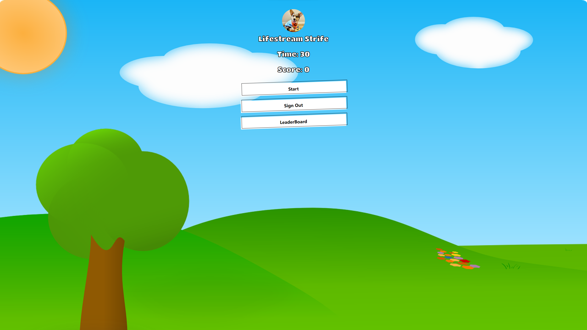

# Project Title

Click-A-Mole

## Demo link:

<!-- Access my site at [google.com](https://google.com) -->

## About The App

[Click-A-Mole] is a web app game that has the user try to click the mole as it appears and disappears on the screen over a period of 30 seconds. each successfull click give the user 1 point which is added up in the score once the end of the 30 seconds is up the score that is shown on the app is your final score for the game. Each missed click will show a animation saying you missed. There is a leaderboard that keeps track of past games played and there ranking which is linked to a database. the sign when you first enter has a google authentication login screen which you can use your google account to sign into. 

## Screenshots

## Technologies

  &nbsp;
  &nbsp;
  &nbsp;
  &nbsp;

## Approach

Built with React and styled with styled components with react-scroll for smooth navigation and react-icons. 
